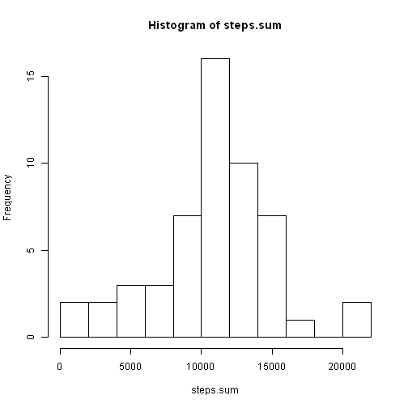
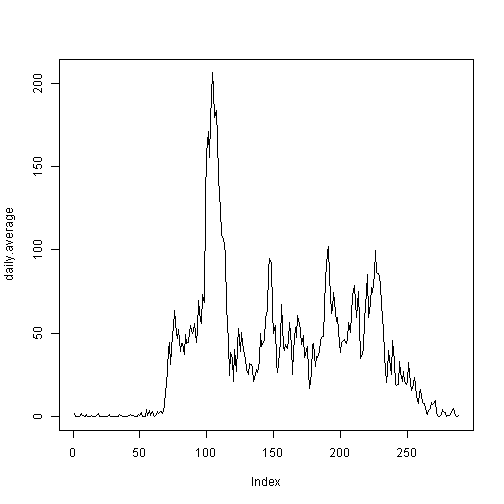
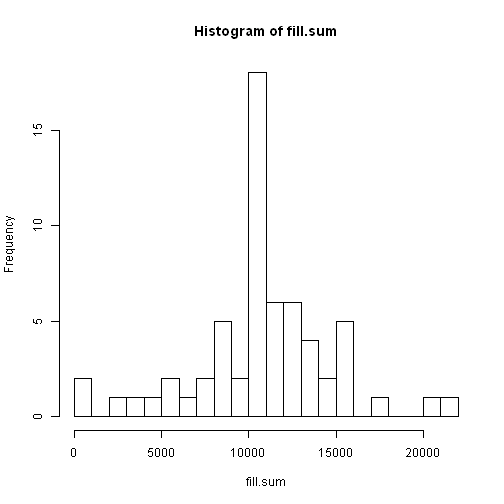
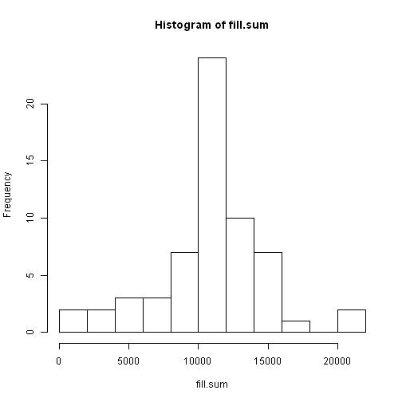
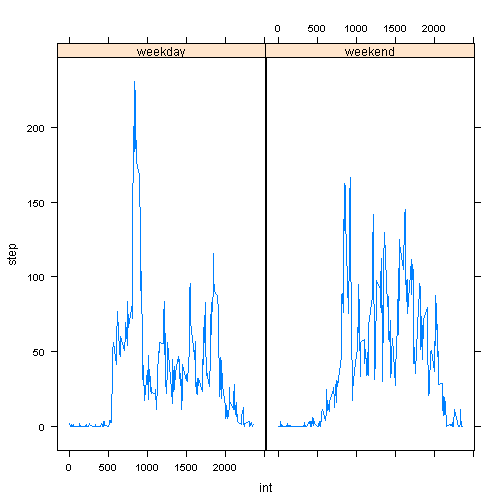

## 1) Loading and preprocessing data


```r
url <- "http://d396qusza40orc.cloudfront.net/repdata%2Fdata%2Factivity.zip"
download.file(url,"activity.zip")
activity <- read.table( unzip("activity.zip"),colClasses=c("numeric","character","numeric"),sep=",",header=TRUE)
colnames(activity)
```

```
## [1] "steps"    "date"     "interval"
```

```r
str(activity)
```

```
## 'data.frame':	17568 obs. of  3 variables:
##  $ steps   : num  NA NA NA NA NA NA NA NA NA NA ...
##  $ date    : chr  "2012-10-01" "2012-10-01" "2012-10-01" "2012-10-01" ...
##  $ interval: num  0 5 10 15 20 25 30 35 40 45 ...
```

```r
nrow(activity)
```

```
## [1] 17568
```

```r
sum(is.na(activity$steps))
```

```
## [1] 2304
```

```r
head(activity$steps)
```

```
## [1] NA NA NA NA NA NA
```

## 2) Mean total number of steps taken per day


```r
data <- activity[complete.cases(activity),]
data$date <- as.factor(data$date)
head(data)
```

```
##     steps       date interval
## 289     0 2012-10-02        0
## 290     0 2012-10-02        5
## 291     0 2012-10-02       10
## 292     0 2012-10-02       15
## 293     0 2012-10-02       20
## 294     0 2012-10-02       25
```

```r
str(data)
```

```
## 'data.frame':	15264 obs. of  3 variables:
##  $ steps   : num  0 0 0 0 0 0 0 0 0 0 ...
##  $ date    : Factor w/ 53 levels "2012-10-02","2012-10-03",..: 1 1 1 1 1 1 1 1 1 1 ...
##  $ interval: num  0 5 10 15 20 25 30 35 40 45 ...
```

```r
steps.sum <- tapply(data$steps,data$date,sum)
length(steps.sum)
```

```
## [1] 53
```

```r
head(steps.sum)
```

```
## 2012-10-02 2012-10-03 2012-10-04 2012-10-05 2012-10-06 2012-10-07 
##        126      11352      12116      13294      15420      11015
```

```r
hist(steps.sum,breaks=10)
```

 

```r
rmean <- mean(steps.sum)
rmedian <- median(steps.sum)
```
The mean is 1.0766 &times; 10<sup>4</sup> and the median is 1.0765 &times; 10<sup>4</sup>.

## 3) Daily average activity pattern


```r
daily.average <- tapply(data$steps,data$interval,mean)
plot(daily.average,type="l")
```

 

```r
max(daily.average)
```

```
## [1] 206.2
```

```r
m <- match(max(daily.average),daily.average)
m
```

```
## [1] 104
```

```r
k <- data$interval[m]
k
```

```
## [1] 835
```
The maximum is the 104-th interval, at minute 835

## 4) Imputting missing values


```r
sum(!complete.cases(activity))
```

```
## [1] 2304
```

```r
data.fill <- activity
data.fill$date <- as.factor(data.fill$date)
data.fill[is.na(data.fill$steps),"steps"] <- daily.average[match(data.fill$interval[is.na(data.fill$steps)],as.numeric(levels(as.factor(data.fill$interval))))]
str(data.fill)
```

```
## 'data.frame':	17568 obs. of  3 variables:
##  $ steps   : num  1.717 0.3396 0.1321 0.1509 0.0755 ...
##  $ date    : Factor w/ 61 levels "2012-10-01","2012-10-02",..: 1 1 1 1 1 1 1 1 1 1 ...
##  $ interval: num  0 5 10 15 20 25 30 35 40 45 ...
```

```r
fill.sum <- tapply(data.fill$steps,data.fill$date,sum)
hist(fill.sum,breaks=20)
```

 

```r
hist(fill.sum,breaks=10)
```

 

```r
mean(fill.sum)
```

```
## [1] 10766
```

```r
median(fill.sum)
```

```
## [1] 10766
```
The median differs from the original histogram. 
By filling in NA values regardless of the method, creates data out of nothing, and thus introduces bias.

## 5) Weekday vs. Weedend activity patterns


```r
data.fill$date <- as.POSIXct(data.fill$date, format="%Y-%m-%d")
data.fill$date <- weekdays(data.fill$date,abbreviate=TRUE)
week <- function(x){
        y <- vector(mode="character",length(x))
        for (i in 1:length(x)){
                if (x[i] == "S" | x[i] == "D") {y[i] <- "weekend"
                }
                else {y[i] <- "weekday"
                }
        }
        y
}
data.week <- cbind(data.fill,as.factor(week(data.fill$date)))
colnames(data.week)[4] <- "weekday"
str(split(data.week,data.week$weekday))
```

```
## List of 2
##  $ weekday:'data.frame':	12960 obs. of  4 variables:
##   ..$ steps   : num [1:12960] 1.717 0.3396 0.1321 0.1509 0.0755 ...
##   ..$ date    : chr [1:12960] "L" "L" "L" "L" ...
##   ..$ interval: num [1:12960] 0 5 10 15 20 25 30 35 40 45 ...
##   ..$ weekday : Factor w/ 2 levels "weekday","weekend": 1 1 1 1 1 1 1 1 1 1 ...
##  $ weekend:'data.frame':	4608 obs. of  4 variables:
##   ..$ steps   : num [1:4608] 0 0 0 0 0 0 0 0 0 0 ...
##   ..$ date    : chr [1:4608] "S" "S" "S" "S" ...
##   ..$ interval: num [1:4608] 0 5 10 15 20 25 30 35 40 45 ...
##   ..$ weekday : Factor w/ 2 levels "weekday","weekend": 2 2 2 2 2 2 2 2 2 2 ...
```

```r
final <- lapply(split(data.week,data.week$weekday),function(x){
        tapply(x$steps,x$interval,mean)
})
str(final)
```

```
## List of 2
##  $ weekday: num [1:288(1d)] 2.251 0.445 0.173 0.198 0.099 ...
##   ..- attr(*, "dimnames")=List of 1
##   .. ..$ : chr [1:288] "0" "5" "10" "15" ...
##  $ weekend: num [1:288(1d)] 0.21462 0.04245 0.01651 0.01887 0.00943 ...
##   ..- attr(*, "dimnames")=List of 1
##   .. ..$ : chr [1:288] "0" "5" "10" "15" ...
```

```r
final.fantasy <- as.data.frame(final)
bins <- as.numeric(rownames(table(activity$interval)))
l <- length(table(activity$interval))
final.fantasy$weekend <- as.numeric(final.fantasy$weekend)
final.fantasy$weekday <- as.numeric(final.fantasy$weekday)
final.final <- as.data.frame(cbind(c(final.fantasy$weekday,final.fantasy$weekend),c(rep("weekday",l),rep("weekend",l)),c(bins,bins)))
colnames(final.final) <- c("step","day","int")
final.final$step <- as.numeric(as.character((final.final$step)))
final.final$int <- as.numeric(as.character((final.final$int)))
str(final.final)
```

```
## 'data.frame':	576 obs. of  3 variables:
##  $ step: num  2.251 0.445 0.173 0.198 0.099 ...
##  $ day : Factor w/ 2 levels "weekday","weekend": 1 1 1 1 1 1 1 1 1 1 ...
##  $ int : num  0 5 10 15 20 25 30 35 40 45 ...
```

```r
library(lattice)
xyplot(step~int|day,data=final.final,type="l")
```

 

During weekdays there is a peak in activity in the morning, wich is lacking in weekends. 
Also in the weekend the activity level seems slightly higher than on weekdays.
(seems like honest working people waking up in the morning, and then socializing in the weekends)
